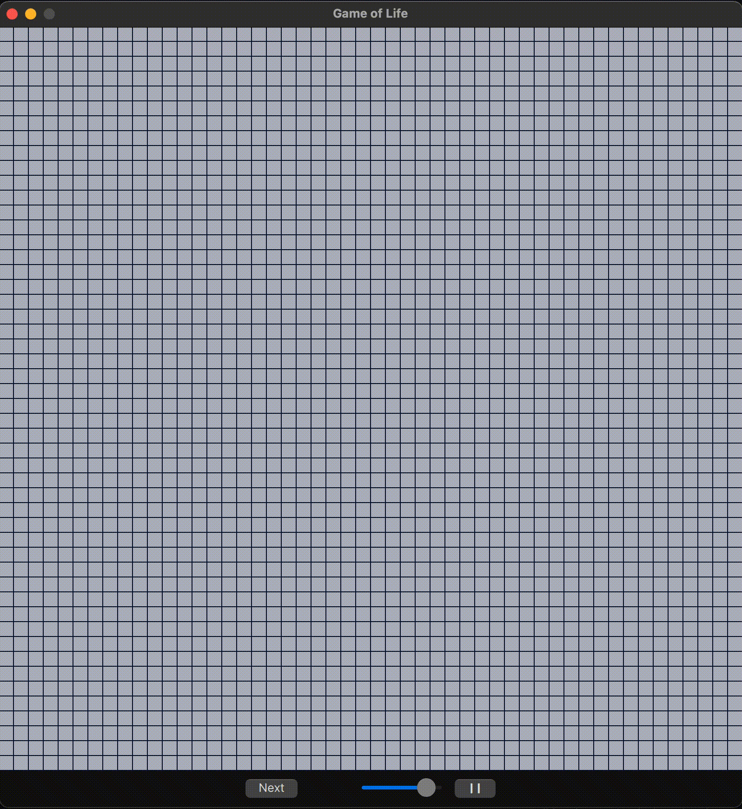

# Game of Life in Qt/QML



The Game of Life is a cellular automaton devised by the British mathematician John Horton Conway in 1970. It is a zero-player game, meaning that its evolution is determined by its initial state, requiring no further input. The Game of Life is Turing complete and can simulate a universal constructor or any other Turing machine.

## Rules

The universe of the Game of Life is an infinite, two-dimensional orthogonal grid of square cells, each of which is in one of two possible states: live or dead. Every cell interacts with its eight neighbors, which are the cells that are horizontally, vertically, or diagonally adjacent. At each step in time, the following transitions occur:

1. Any live cell with fewer than two live neighbors dies, as if by underpopulation.
2. Any live cell with two or three live neighbors lives on to the next generation.
3. Any live cell with more than three live neighbors dies, as if by overpopulation.
4. Any dead cell with exactly three live neighbors becomes a live cell, as if by reproduction.

These rules can be condensed into the following:

1. Any live cell with two or three live neighbors survives.
2. Any dead cell with three live neighbors becomes a live cell.
3. All other live cells die in the next generation, and all other dead cells stay dead.

The initial pattern constitutes the seed of the system. Each generation is a pure function of the preceding one, and the rules continue to be applied repeatedly to create further generations.

## Origins

The Game of Life has its origins in the work of Stanislaw Ulam and John von Neumann at the Los Alamos National Laboratory in the 1940s. Ulam studied the growth of crystals using a lattice network as a model, while von Neumann worked on self-replicating systems. Ulam and von Neumann created a method for calculating liquid motion based on discrete units, giving birth to the first system of cellular automata.

John Conway began experimenting with different two-dimensional cellular automaton rules in 1968, aiming to define an interesting and unpredictable cellular automaton. The Game of Life made its first public appearance in the October 1970 issue of Scientific American. Since then, it has attracted much interest due to the surprising ways in which patterns can evolve. The Game of Life is considered a simulation game and has been used in various fields, including physics, mathematics, and philosophy.

## Examples of Patterns

The Game of Life exhibits various patterns that can be classified into different types based on their behavior. Some common pattern types include still lifes, oscillators, and spaceships.

### Still Lifes
- Block
- Beehive
- Loaf
- Boat
- Tub

### Oscillators
- Blinker (period 2)
- Toad (period 2)
- Beacon (period 2)
- Pulsar (period 3)
- Penta-decathlon (period 15)

### Spaceships
- Glider
- Lightweight spaceship (LWSS)
- Middleweight spaceship (MWSS)
- Heavyweight spaceship (HWSS)

These are just a few examples of the patterns that can occur in the Game of Life. There are many other types of patterns, including those that exhibit infinite growth and complex interactions.

## Usage

To build the Game of Life project, follow these steps:

1. Make sure you have CMake version 3.15 or higher installed.
2. Run the following commands in your terminal:

```bash
cmake -S . -B ./build
cmake --build ./build
```

This will generate the necessary build files and compile the project.

## Dependencies

The Game of Life project depends on the following components of Qt6 version 6.

## License

This project is licensed under the MIT License. See the [LICENSE](LICENSE) file for details.